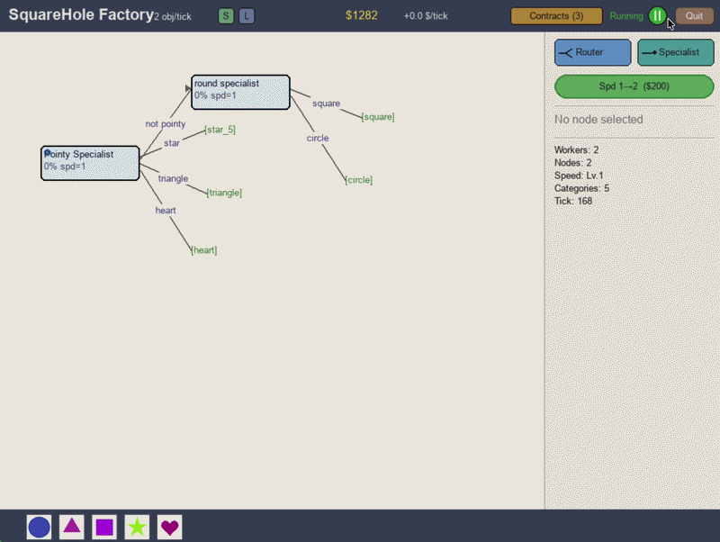
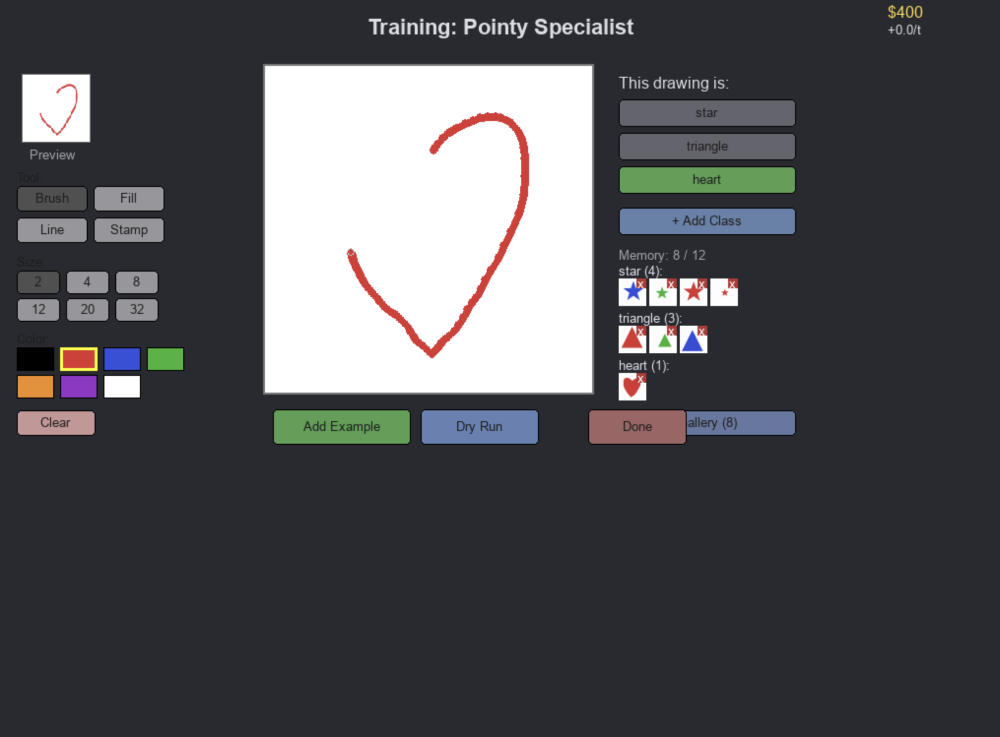
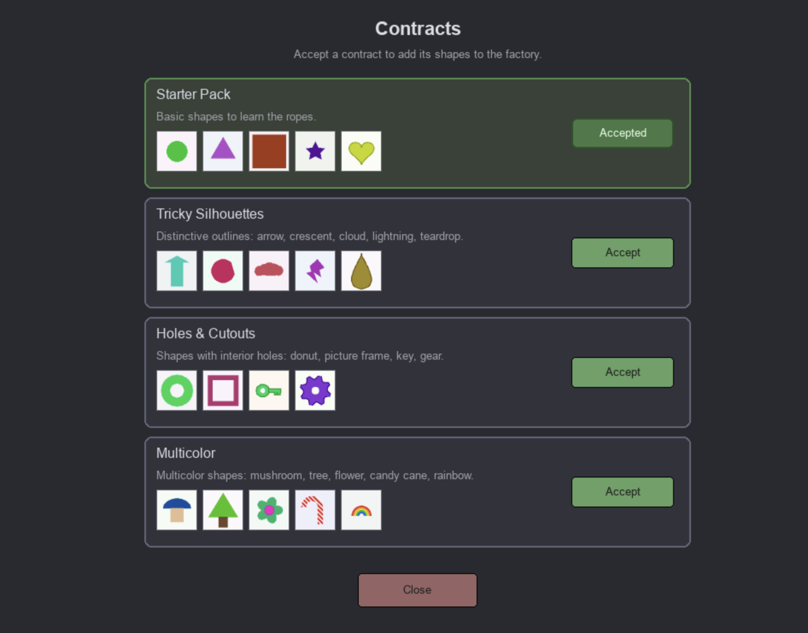

# SquareHole

A Factorio-style idle factory game where every worker on the floor is a real, MAML-adapted neural network you train yourself by drawing examples.






## Quick start

Requires **Python 3.11** (learn2learn has build issues on 3.12+). Apple Silicon users get MPS acceleration automatically.

```bash
python3.11 -m venv .venv
.venv/bin/pip install -r requirements.txt
.venv/bin/python -m app.main
```

A 1024×768 pygame window will open. Drop a worker on the floor, draw a few examples of each shape in the canvas, hit play, and watch the coins start trickling in.

Other useful commands:

```bash
# Headless balance validation (generalist vs routing strategies at scale)
.venv/bin/python app/simulation/headless.py

# Meta-train the general backbone from scratch (~10 min on MPS)
.venv/bin/python meta_training/train_general.py --hidden 128 --iterations 1000

# Evaluate per-concept accuracy of a trained checkpoint
.venv/bin/python meta_training/eval_concepts.py
```

## Inspiration

SquareHole started as a half-joke and ended up somewhere genuinely interesting. I wanted to make a Tamagotchi, but for a machine learning model; a little neural "child" you raise by patiently showing it things and telling it what they're called. But why train a child without putting it to work... for profit? The obvious shape for the game became Factorio. Conveyor belts, branching routes, throughput, ever-growing factories... except, every worker on the floor is a real, adapted neural network you taught yourself.

## What it does

Procedurally generated shapes (circles, stars, hearts, gears, lightning bolts, mushrooms, etc.) drop onto your factory floor. You design a routing graph: a DAG of worker nodes that each look at an incoming shape, classify it, and forward it down one of their output edges. Leaves of the graph are bins; the right shape in the right bin pays you coins, and getting it incorrect costs you. Wrong answers hurt much more than dropped ones, which is the whole economic engine of the game: accuracy is what makes you money, not raw throughput.

A typical setup looks like this. A new player automatically accepts the Starter contract (circles, triangles, squares, five-pointed stars, hearts) and plops down a single generalist worker that tries to sort all five into five bins. They draw a few examples of each in the built-in canvas (brush, fill, line, and stamp tools, like a tiny MS Paint), the worker adapts, and coins start trickling in. Then the Tricky Silhouettes contract unlocks arrows, crescents, clouds, lightning bolts, and teardrops, and the generalist falls apart. Every worker has a hard memory cap of ten total examples, and ten examples spread across ten classes is just one shot per class. So the player splits the problem. They train an upstream router on a binary concept they invented themselves ("pointy vs round," say) and route each branch to a smaller, more focused worker downstream. Layer enough of these splits and you've effectively built a decision tree of neural networks, each one only responsible for telling apart a handful of things.

The game is dense with features that exist to support this loop. The drawing canvas lets you teach by example with brush, bucket fill, line, and shape-stamp tools. A radial context menu on each node gives you teach / inspect / delete / connect actions without cluttering the screen. A force-directed graph layout engine keeps your DAG legible as it grows, with depth-constrained left-to-right positioning, rectangular collision avoidance, and edge springs tuned for label readability, and a minimap in the corner lets you pan around once your factory outgrows the viewport. Live flow animation shows actual shape thumbnails sliding along edges, each one ringed in green or red based on whether it makes it to the correct bin. There's a contracts overlay for accepting new shape packs (Starter, Tricky Silhouettes, Holes & Cutouts, Multicolor), an economy with global speed upgrades, full save/load, a dry-run mode for testing a setup before committing it, a training overlay that shows you a worker's support set and current confusions, and a headless simulation harness for balance-testing generalist-vs-routing strategies at scale.

The connection to real machine learning isn't a metaphor. Every classification you watch happen on screen is an actual forward pass through a real Conv4 CNN whose weights have been adapted to your hand-drawn examples by MAML's inner loop. When you draw a new triangle and drop it into a worker's training set, the worker re-adapts and its accuracy genuinely changes. When you split a hard problem into two easier ones, the math really does favor you; the same way it would in a research notebook.

## How I built it

The stack is Python 3.11, PyTorch (with MPS acceleration on Apple Silicon), `learn2learn` for the MAML implementation, and pygame for the 1024×768 game window. The whole project is structured around a single universal data format: a `FactoryObject` is a `(3, 84, 84)` normalized image tensor plus a category label and an attribute dict, and that's what flows through every belt, every worker, and every bin.

The model itself is a Conv4 backbone, which is the standard few-shot learning workhorse: four convolutional blocks, each one a 3×3 conv followed by batch norm, ReLU, and 2×2 max pooling. An 84×84×3 input gets downsampled four times to a 5×5 feature map, which flattens into a 1600-dimensional embedding for the Conv4-64 variant I ship at runtime (about 113K parameters; small enough to adapt in milliseconds on every tick of the game). On top of the backbone sits a detachable linear classification head that gets rebuilt whenever a worker learns a new class.

MAML (Model-Agnostic Meta-Learning) is what makes the whole game possible. The key insight of MAML is that instead of training a model to *do* a task, you train it to be *easy to fine-tune to* a task. During meta-training I sample thousands of tiny binary classification "episodes" from a procedural shape generator that has eight built-in visual features (curved vs straight, sharp vs rounded, elongated vs compact, holes vs solid, branching vs unitary, lopsided vs balanced, bumpy vs smooth, multicolor vs mono). For each episode the outer training loop clones the model, runs five gradient steps of inner-loop adaptation on a five-shot support set, evaluates on a query set, and then takes a meta-gradient step *through* that adaptation. The model backpropagates not through the model's predictions but through the *process of learning* itself. The result is a backbone whose weights sit at a sweet spot in parameter space where five gradient steps in any reasonable direction land you on a useful classifier. When the player teaches a worker in-game, that worker clones the meta-trained MAML, runs 5-20 inner-loop steps on the player's drawings, caches the adapted learner, and then runs real inference against it on every shape the factory produces. I deliberately pre-train *features*, not shape recognition, by making the meta-training shape vocabulary disjoint from the game's shape vocabulary. So, when you teach the model a brand new concept it has never seen, it's leaning on general visual features, not memorized templates.

Around that core sit a force-directed layout engine for the DAG (five forces: depth-constrained x-positioning, node repulsion, edge springs at 200px ideal length, rectangular collision, and a weak y-centering pull, converging in 10 to 25 iterations), a virtual-canvas coordinate system with minimap pan-and-zoom for large factories, an economy module, a contract progression system, a save/load layer, and a headless simulator that can run thousands of ticks at scale to validate balance.

## Module layout

- `app/main.py`: entry point, pygame loop
- `app/factory/`: game logic
  - `objects.py`: procedural shape generation
  - `worker.py`: MAML wrapper, support sets, real inference, the `MEMORY_CAP = 10` lever
  - `routing.py`: the DAG graph
  - `world.py`: tick driver
  - `economy.py`: coins, rewards, penalties (wrong = 8, drop = 1)
  - `contracts.py`: the four shape packs (Starter, Tricky Silhouettes, Holes & Cutouts, Multicolor)
- `app/ui/`
  - `factory_floor.py`: main game screen (~1500 lines)
  - `graph_layout.py`: force-directed DAG layout
  - `drawing_canvas.py`: brush, fill, line, and stamp tools
- `app/models/`
  - `conv4.py`: `Conv4Backbone` and `Conv4WithHead`
  - `checkpoints/`: trained backbones (runtime prefers `general_conv4_192_robust.pt`, with fallbacks to legacy 192 and 128 checkpoints)
- `meta_training/`
  - `procedural_meta.py`: the eight-feature episode generator
  - `train_general.py`: MAML training loop
  - `synthetic_shapes.py`: shape primitives
  - `eval_concepts.py`: per-concept accuracy evaluator
- `app/simulation/headless.py`: headless harness for balance testing

No linter or test suite is configured. `tests/` exists but is empty.

## Challenges I ran into

Keeping the user experience stable on top of a feature-rich and increasingly complicated network was the constant fight. Workers, bins, edges, the layout engine, the drawing canvas, the training overlay, the radial menu, the minimap, flow animation, dry-run mode, and the economy all share state and need to stay consistent through every tick.

Balance was the second hard problem. Early versions made generalist workers too strong: a single node trained on a handful of examples could clear the whole factory and there was no economic pressure to ever build a routing tree. The fix was the per-worker memory cap: ten examples *total*, not per class, which forces few-shot scaling and turns "build a deeper tree" into the only viable answer once the catalogue grows. Tuning the wrong-vs-drop penalty ratio (8 vs 1) was the other half of the same lever. Accuracy had to dominate throughput, not the other way around.

The third challenge was making sure the MAML backbone actually supported the kinds of concepts a real player would invent. For it to be interesting, the meta-training curriculum had to be built around abstract visual features rather than specific shapes, and the procedural generator had to produce shapes deliberately *unlike* anything in the in-game vocabulary so the backbone learned to generalize features instead of memorizing templates.

## Accomplishments I'm proud of

The game has a high skill ceiling and a satisfyingly wide solution space; there's no single "correct" factory layout, and watching different players converge on different strategies for the same contract pack is genuinely fun. The MAML backbone is trained from scratch on my own procedural curriculum, not borrowed from a pretrained vision model, and it actually works few-shot on player-invented concepts. The drawing-and-teaching loop genuinely *feels* like raising and training your own little model, which was the original Tamagotchi-shaped pitch I started from. And the auto-laid-out DAG, with its force-directed physics and minimap navigation, makes complex factories legible in a way I'm quietly proud of; graph layout is one of those things that's invisible when it works and unforgivable when it doesn't.

## What I learned

Few-shot training from a meta-learned backbone really is possible; five examples and five gradient steps is enough to get a useful classifier when the backbone has been pre-positioned correctly, and it's startling how close MAML's promise gets to MAML's delivery in practice. I also learned, the slightly painful way, that idle games are fun *because* they leave the player room to breathe; every time I cranked the spawn rate or tightened the economy the game got worse, not better. And finally: a game can be a surprisingly good way to teach machine learning. Concepts like the few-shot regime, the bias-variance tradeoff, the value of decomposition, and the difference between memorization and generalization are all things you have to *feel* in SquareHole to make money, and feeling them is a much stickier kind of learning than reading them.

## What's next for SquareHole

Polishing it up and getting it in front of players. The mechanics are there, the model works, and the loop is fun; now I want to publish it so people can build their own absurd neural-network factories and find out what their own routing instincts look like.
